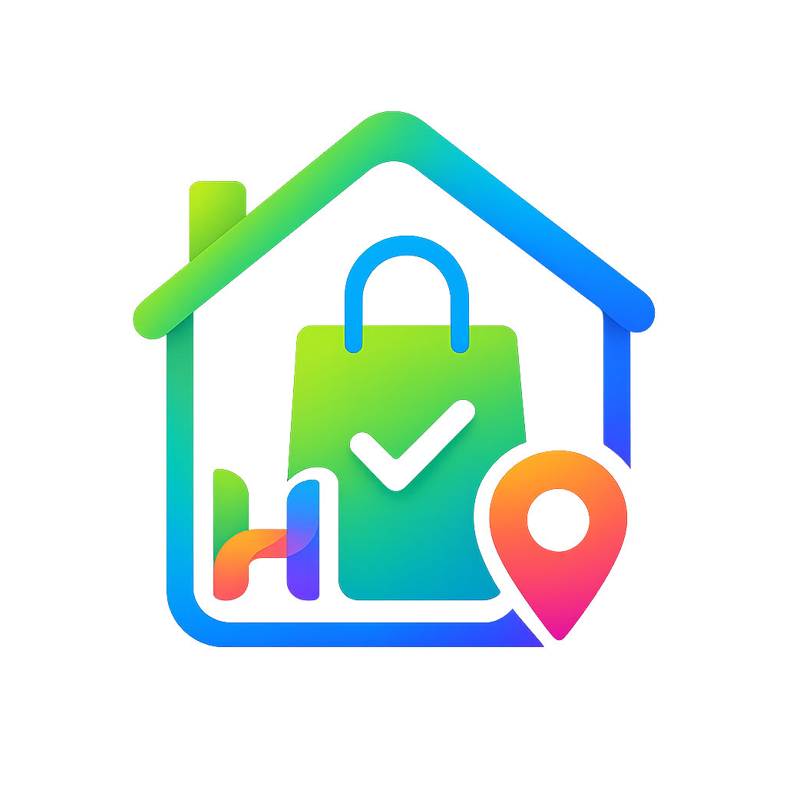

<div align="center">
  
  <h1>HomeSync</h1>
  <p><strong>The ultimate family coordination app designed to keep your household perfectly in sync.</strong></p>

  <p>
    
    
    
    
    
  </p>
</div>

<hr />

## 🌟 Overview

HomeSync replaces fragmented group chats, forgotten grocery items, and messy whiteboards with a single, elegant solution. Built as a high-performance cross-platform mobile application, HomeSync brings your family's activities, shopping lists, and location-based updates into one centralized hub. 

Available on Android, iOS, and the Web.

## ✨ Key Features

### 🛒 Smart Shopping List & AI Voice Quick-Add
Never forget the groceries again. Our shared shopping list syncs instantly across all family devices in real-time. 
* **AI Voice Commands:** Simply tap the microphone and say, *"Add milk, eggs, and three apples,"* and our Gemini AI integration will automatically parse, categorize, and add the items to your list.

### 📍 Location Geofencing & Custom Map Pins
Get smart, location-aware reminders exactly when you need them.
* **Geofencing:** Receive an alert when a family member is near a supermarket and items are still pending on the list.
* **Custom Pins:** Missing a local mom-and-pop shop on standard maps? Drop your own custom pins so your family always knows exactly where to go.

### 🔔 Real-Time Activity Feed
Stay in the loop without the constant "Did you buy it?" texts.
* The Activity Feed logs all family actions—from someone adding an item to the list, to checking it off, or even when a new family member joins the household.

### 👨‍👩‍👧‍👦 Family Management
* Seamlessly create a secure family workspace.
* Invite members using simple 6-character invite codes.
* Admin controls for managing the household roster directly from the Profile page.

---

## 🚀 Getting Started

### Prerequisites
* [Node.js](https://nodejs.org/) (v16+)
* [Android Studio](https://developer.android.com/studio) (for Android deployment)
* A Firebase Project
* Google Maps API Key
* Google Gemini API Key

### Installation

1. **Clone the repository:**
   ```bash
   git clone https://github.com/N0-DE/HomeSyncr.git
   cd homesync
   ```

2. **Install dependencies:**
   ```bash
   npm install
   ```

3. **Environment Setup:**
   Create a `.env` file in the root directory and add your credentials:
   ```env
   VITE_FIREBASE_API_KEY=your_api_key
   VITE_FIREBASE_AUTH_DOMAIN=your_auth_domain
   VITE_FIREBASE_PROJECT_ID=your_project_id
   VITE_FIREBASE_STORAGE_BUCKET=your_storage_bucket
   VITE_FIREBASE_MESSAGING_SENDER_ID=your_messaging_sender_id
   VITE_FIREBASE_APP_ID=your_app_id
   VITE_FIREBASE_VAPID_KEY=your_vapid_key
   
   VITE_GOOGLE_MAPS_API_KEY=your_google_maps_key
   VITE_GEMINI_API_KEY=your_gemini_api_key
   ```

4. **Run on Web (Development):**
   ```bash
   npm run dev
   ```

5. **Deploy to Mobile (Android via Capacitor):**
   ```bash
   npm run build
   npx cap sync android
   npx cap run android
   ```

---

## 🛠 Tech Stack & Architecture

* **Frontend:** React, Vite, Tailwind CSS, Lucide Icons.
* **Backend / Database:** Firebase Authentication, Cloud Firestore.
* **Mobile Bridge:** Ionic Capacitor (Accessing native Geolocation and Speech Recognition APIs).
* **AI:** Google Gemini (Structured entity extraction).
* **Maps:** Google Maps JavaScript API.

### Clean Separation of Concerns
HomeSync enforces a strict architectural boundary:
* **`components/` & `pages/`:** Pure React UI. Zero database imports.
* **`services/`:** All Firebase, Google Maps, and Gemini logic. 
* **`hooks/`:** Real-time listeners wrapping the service layer.

This clean separation ensures high maintainability and highly modular code.

---

<div align="center">
  <i>Made with ❤️ for families everywhere.</i>
</div>
